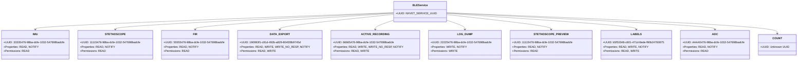

# BLE Protocol Diagram

This diagram shows the BLE attributes, their UUIDs, and their configurations used in the application.

```mermaid
classDiagram
    class BLEService {
        +UUID: NXVET_SERVICE_UUID
    }
    class IMU {
        +UUID: 33335476-98ba-dcfe-1032-547698badcfe
        +Properties: READ, NOTIFY
        +Permissions: READ
    }
    BLEService --> IMU
    class STETHOSCOPE {
        +UUID: 11115476-98ba-dcfe-1032-547698badcfe
        +Properties: READ, NOTIFY
        +Permissions: READ
    }
    BLEService --> STETHOSCOPE
    class FIR {
        +UUID: 55555476-98ba-dcfe-1032-547698badcfe
        +Properties: READ, NOTIFY
        +Permissions: READ
    }
    BLEService --> FIR
    class DATA_EXPORT {
        +UUID: 190993f1-c81d-492b-a829-804f28b9745d
        +Properties: READ, WRITE, WRITE_NO_RESP, NOTIFY
        +Permissions: READ, WRITE
    }
    BLEService --> DATA_EXPORT
    class ACTIVE_RECORDING {
        +UUID: 66665476-98ba-dcfe-1032-547698badcfe
        +Properties: READ, WRITE, WRITE_NO_RESP, NOTIFY
        +Permissions: READ, WRITE
    }
    BLEService --> ACTIVE_RECORDING
    class LOG_DUMP {
        +UUID: 22225476-98ba-dcfe-1032-547698badcfe
        +Properties: WRITE, NOTIFY
        +Permissions: WRITE
    }
    BLEService --> LOG_DUMP
    class STETHOSCOPE_PREVIEW {
        +UUID: 11115476-98ba-dcfe-1032-547698badcfe
        +Properties: READ, NOTIFY
        +Permissions: READ
    }
    BLEService --> STETHOSCOPE_PREVIEW
    class LABELS {
        +UUID: b5f53348-c601-471d-8ede-f90b24760875
        +Properties: READ, WRITE, NOTIFY
        +Permissions: READ, WRITE
    }
    BLEService --> LABELS
    class ADC {
        +UUID: AAAA5476-98ba-dcfe-1032-547698badcfe
        +Properties: READ, NOTIFY
        +Permissions: READ
    }
    BLEService --> ADC
    class COUNT {
        +UUID: Unknown UUID
    }
    BLEService --> COUNT
```