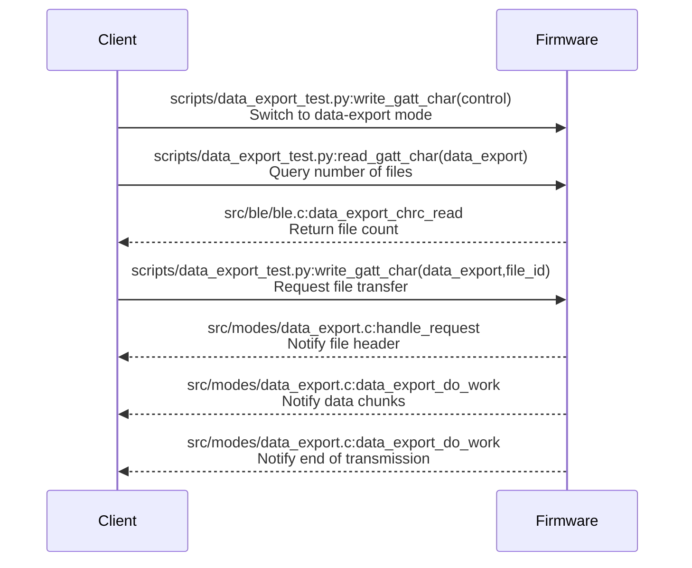

# Data Export Process Sequence Diagram

Below is a step-by-step BLE interaction between the Python client and firmware during data export.

```mermaid
sequenceDiagram
    participant Client
    participant Firmware

    Client->>Firmware: scripts/data_export_test.py:write_gatt_char(control) <br/> Switch to data-export mode
    Client->>Firmware: scripts/data_export_test.py:read_gatt_char(data_export) <br/> Query number of files
    Firmware-->>Client: src/ble/ble.c:data_export_chrc_read <br/> Return file count
    Client->>Firmware: scripts/data_export_test.py:write_gatt_char(data_export,file_id) <br/> Request file transfer
    Firmware-->>Client: src/modes/data_export.c:handle_request <br/> Notify file header
    Firmware-->>Client: src/modes/data_export.c:data_export_do_work <br/> Notify data chunks
    Firmware-->>Client: src/modes/data_export.c:data_export_do_work <br/> Notify end of transmission
``` 